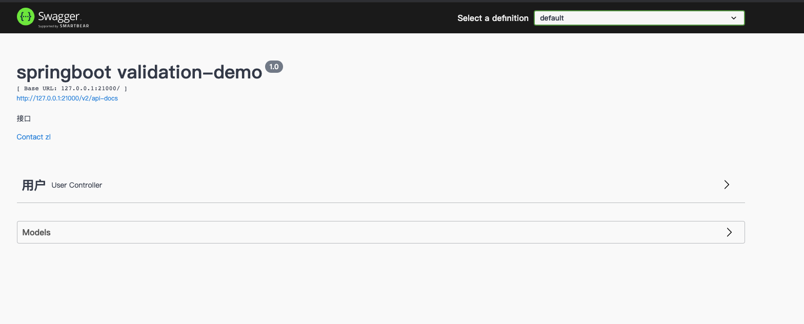

本文档demo全部基于Spring Boot 2.7.3 如有错误请检查是否为包版本冲突

## SpringBoot Validation

Java API规范(JSR303)定义了Bean校验的标准validation-api，但没有提供实现。hibernate validation是对这个规范的实现，并增加了校验注解如@Email、@Length等。

Spring Validation是对hibernate validation的二次封装，用于支持spring mvc参数自动校验。接下来，我们以spring-boot项目为例，介绍Spring Validation的使用。

### 常用注解

1. *@NotNull使用在Bean的字段注解中。它是 JSR303（Bean的校验框架）的注解，在controller的方法中验证时(运行时检查一个属性是否为空)使用，如果不合法(为空)，注解中的提示信息会保存在result中*
2. *@Null 被注释的元素必须为null*
3. *@NotNull 被注释的元素不能为null，可以为空字符串*
4. *@AssertTrue 被注释的元素必须为true*
5. *@AssertFalse 被注释的元素必须为false*
6. *@Min(value) 被注释的元素必须是一个数字，其值必须大于等于指定的最小值*
7. *@Max(value) 被注释的元素必须是一个数字，其值必须小于等于指定的最大值*
8. *@DecimalMin(value) 被注释的元素必须是一个数字，其值必须大于等于指定的最小值*
9. *@DecimalMax(value) 被注释的元素必须是一个数字，其值必须小于等于指定的最大值*
10. *@Size(max,min) 被注释的元素的集合大小必须在指定的范围内。*
11. *@Digits(integer,fraction) 被注释的元素必须是一个数字，其整数和小数位数等于指定的值*
12. *@Past 被注释的元素必须是一个过去的日期*
13. *@Future 被注释的元素必须是一个将来的日期*
14. *@Pattern(value) 被注释的元素必须符合指定的正则表达式。*
15. *@Email 被注释的元素必须是电子邮件地址*
16. *@Length 被注释的字符串的大小必须在指定的范围内*
17. *@Range 被注释的元素必须在合适的范围内*
18. *@NotEmpty：用在集合类上，不能为null，并且长度必须大于0*
19. *@NotBlank：只能作用在String上，不能为null，而且调用trim()后，长度必须大于0*

### 快速开始

#### 引入依赖

`如果spring-boot版本小于2.3.x，spring-boot-starter-web会自动传入hibernate-validator依赖。如果spring-boot版本大于2.3.x，则需要手动引入依赖：`

```xml
    <dependency>
        <groupId>org.springframework.boot</groupId>
        <artifactId>spring-boot-starter-validation</artifactId>
    </dependency>
```

对于web服务来说，为防止非法参数对业务造成影响，在Controller层一定要做参数校验的！大部分情况下，请求参数分为如下两种形式：

- POST、PUT请求，使用requestBody传递参数；
- GET 请求，使用requestParam/PathVariable传递参数。

下面我们简单介绍下 requestBody 和 requestParam/PathVariable 的参数校验实战！

#### RequestBody参数校验

POST、PUT 请求一般会使用requestBody传递参数，这种情况下，后端使用DTO对象进行接收。

只要在使用DTO接收参数的地方使用@Validated注解就能实现自动参数校验。

`默认情况：如果校验失败，会抛出MethodArgumentNotValidException异常，Spring默认会将其转为400（Bad Request）请求`

- **在DTO字段上声明约束注解**

```java
    @Data
    public class UserDTO {
		@NotNull
    	private Long userId;
        @NotBlank
        private String name;
        @Range(max = 100, min = 18)
        private int age;
        @Sex
        private String sex;
        @Email
        private String email;
        @JsonFormat(pattern = "yyyy-MM-dd HH:mm:ss", timezone = "GMT+8")
        @Past
        private Date birthday;

    }
```

`注意：springboot中默认使用的json框架为jackson，jackson并不支持日期格式：yyyy-MM-dd HH:mm:ss，因此以上DTO中使用@JsonFormat进行转换，否则会报错`

- **在接口参数上声明注解，这种情况下，使用@Valid和@Validated都可以**

```java
    @PostMapping("addUser")
    public HttpResult addUser(@RequestBody @Validated UserDTO saveUserDto){
        log.info("saveUserDto : {}", saveUserDto);
        return HttpResult.success("添加用户成功!");
    }
```

- **RequestParam/PathVariable传参**

`在这种情况下，必须在Controller类上标注@Validated注解，并在入参上声明约束注解(如@Min等)。如果校验失败，会抛出ConstraintViolationException异常。`

```java
    // PathVariable 传参
    @GetMapping("{userId}")
    public HttpResult detail(@PathVariable("userId") @Min(100L) Long userId) {
        return HttpResult.success();
    }

    // @RequestParam 传参
    @GetMapping("getByName")
    public HttpResult getByName(@Length(min = 8, max = 20) @NotNull String  name) {
        return HttpResult.success();
    }
```

- **默认情况下参数校验不通过请求报400错误**

```json
    {
        "timestamp": 1661507566388,
        "status": 400,
        "error": "Bad Request",
        "path": "/user/addUser"
    }
```

#### 统一异常处理

如果校验失败，会抛出MethodArgumentNotValidException或者ConstraintViolationException异常。在实际项目开发中，通常会使用统一异常处理来打印日志及包装提示。

```java
    import lombok.extern.slf4j.Slf4j;
    import org.springframework.beans.NotReadablePropertyException;
    import org.springframework.http.HttpStatus;
    import org.springframework.validation.BindingResult;
    import org.springframework.validation.FieldError;
    import org.springframework.web.bind.MethodArgumentNotValidException;
    import org.springframework.web.bind.annotation.ExceptionHandler;
    import org.springframework.web.bind.annotation.ResponseBody;
    import org.springframework.web.bind.annotation.ResponseStatus;
    import org.springframework.web.bind.annotation.RestControllerAdvice;

    import javax.validation.ConstraintViolationException;
    import java.util.StringJoiner;

    @Slf4j
    @RestControllerAdvice
    public class CommonExceptionHandler {

        @ExceptionHandler({MethodArgumentNotValidException.class})
        @ResponseStatus(HttpStatus.OK)
        @ResponseBody
        public HttpResult<String> handleMethodArgumentNotValidException(MethodArgumentNotValidException ex) {
            BindingResult bindingResult = ex.getBindingResult();
            StringJoiner joiner = new StringJoiner("");
            for (FieldError fieldError : bindingResult.getFieldErrors()) {
                // 拼接错误信息， 参数名:message；
                joiner.add(fieldError.getField()).add(":").add(fieldError.getDefaultMessage()).add("; ");
            }
            String msg = joiner.toString();
           return HttpResult.fail(msg);
        }

        @ExceptionHandler({ConstraintViolationException.class})
        @ResponseStatus(HttpStatus.OK)
        @ResponseBody
        public HttpResult handleConstraintViolationException(ConstraintViolationException ex) {
            return HttpResult.fail(ex.getMessage());
        }


        // 全局异常处理
        @ExceptionHandler({Exception.class})
        @ResponseStatus(HttpStatus.OK)
        @ResponseBody
        public HttpResult handleException(Exception ex) {
            log.error("未知错误", ex);
            return HttpResult.fail(ex.getMessage());
        }

    }
```

### 进阶使用

#### 分组校验

实际项目开发中，会多个方法需要使用同一个DTO类来接收参数，而不同方法的校验规则是不一样的。这个时候，简单地在DTO类的字段上加约束注解无法解决这个问题。因此，spring-validation支持了分组校验的功能，专门用来解决这类问题。还是上面的例子，比如保存User的时候，userId是可空的，但是更新User的时候，UserId的值不能为空；其它字段的校验规则在两种情况下一样。这个时候使用分组校验的代码示例如下：

```java
    @Data
    public class UserDTO {
        @NotNull(groups = Update.class)
        @Null(groups = Save.class)
        private Long userId;
        @NotBlank
        private String name;
        @Range(max = 100, min = 18)
        private int age;
        @Sex
        private String sex;
        @Email
        private String email;
        @JsonFormat(pattern = "yyyy-MM-dd HH:mm:ss", timezone = "GMT+8")
        @Past
        private Date birthday;

        // 保存的时候校验分组
        public interface Save { }
        //更新的时候校验分组
        public interface Update {}

    }
```

`在元素注解增加参数groups用于将不同的元素进行分组，假设UserDTO只有新增、编辑两个接口在使用并且只有userId有区别，仅需要在userId上区分不同的组。`

接口的注解@Validated需要增加验证组

```java
	@PostMapping("addUser")
    public HttpResult addUser(@RequestBody @Validated({UserDTO.Save.class, Default.class}) UserDTO saveUserDTO){
        log.info("saveUserDTO : {}", saveUserDTO);
        return HttpResult.success("添加用户成功!");
    }

    @PostMapping("updateUser")
    public HttpResult updateUser(@RequestBody @Validated({UserDTO.Update.class, Default.class}) UserDTO updateUserDTO){
        log.info("updateUserDTO : {}", updateUserDTO);
        return HttpResult.success("修改用户成功!");
    }
```

`注意：当存在公共的校验元素时，默认分组 Default.class 必须要加，否则仅校验Save、Update组标记的元素`

#### 嵌套校验

前面例子中都是基于基本数据类型进行校验，但实际场景中DTO中会出现对象的引用，这种情况下就可以使用嵌套校验，如UserDTO中引用Address对象

`此时DTO类中引用的对象必须标记@Valid注解。`

```java
    @Data
    public class UserDTO {
        @NotNull(groups = Update.class)
        @Null(groups = Save.class)
        private Long userId;
        @NotBlank
        private String name;
        @Range(max = 100, min = 18)
        private int age;
        @Sex
        private String sex;
        @Email
        private String email;
        @JsonFormat(pattern = "yyyy-MM-dd HH:mm:ss", timezone = "GMT+8")
        @Past
        private Date birthday;
        @Valid
        @NotNull
        private Address address;

        @Data
        public static class Address{
            @Length(min = 6, max = 20)
            @NotBlank
            private String detailed;
        }

        // 保存的时候校验分组
        public interface Save { }
        //更新的时候校验分组
        public interface Update {}

    }
```

`嵌套校验可以结合分组校验一起使用。还有就是嵌套集合校验会对集合里面的每一项都进行校验，例如List<Address>字段会对这个list里面的每一个Address对象都进行校验。`

#### 集合校验

如果请求体直接传递了json数组给后台，并希望对数组中的每一项都进行参数校验。此时，如果我们直接使用java.util.Collection下的list或者set来接收数据，参数校验并不会生效！我们可以使用自定义list集合来接收参数：

```java
    import lombok.Data;
    import lombok.experimental.Delegate;

    import javax.validation.Valid;
    import java.util.ArrayList;
    import java.util.List;

    @Data
    public class ValidationList<E> implements List<E> {

        @Delegate // @Delegate是lombok注解（1.18.6版本以上）,将对ValidationList的调用委托到list中
        @Valid // 一定要加@Valid注解
        public List<E> list = new ArrayList<>();

        /**
         * 必须要重写toString方法
         */
        @Override
        public String toString() {
            return list.toString();
        }
    }
```

接口示例

```java
    @PostMapping("batchAddUser")
    public HttpResult batchAddUser(@RequestBody @Validated({UserDTO.Save.class, Default.class}) ValidationList<UserDTO> userDTOList){
        log.info("userDTOList : {}", userDTOList);
        return HttpResult.success("批量添加用户成功!");
    }
```

注意：如果不需要分组的功能，使用以下方式也一样，否则在接口传参上添加主键@Valid会导致分组功能失效

```java
	@PostMapping("batchAddUser")
    public HttpResult batchAddUser(@RequestBody @Valid List<UserDTO> userDTOList){
        log.info("userDTOList : {}", userDTOList);
        return HttpResult.success("批量添加用户成功!");
    }
```

#### 自定义校验

业务需求总是比框架提供的这些简单校验要复杂的多，我们可以自定义校验来满足我们的需求。自定义spring validation 非常简单，假设我们自定义sex（性别只有男和女）校验，主要分为两步：

- 自定义约束注解

```java
    import javax.validation.Constraint;
    import javax.validation.Payload;
    import java.lang.annotation.Documented;
    import java.lang.annotation.Retention;
    import java.lang.annotation.Target;

    import static java.lang.annotation.ElementType.*;
    import static java.lang.annotation.RetentionPolicy.RUNTIME;

    @Target({METHOD, FIELD, ANNOTATION_TYPE, CONSTRUCTOR, PARAMETER})
    @Retention(RUNTIME)
    @Documented
    @Constraint(validatedBy = {SexValidator.class})
    public @interface Sex {

        // 默认错误消息
        String message() default "性别格式错误";

        // 分组
        Class<?>[] groups() default {};

        // 负载
        Class<? extends Payload>[] payload() default {};

    }
```

- 实现ConstraintValidator接口编写约束校验器

```java
    import javax.validation.ConstraintValidator;
    import javax.validation.ConstraintValidatorContext;
    import java.util.Objects;

    public class SexValidator implements ConstraintValidator<Sex, String> {

        private static final String MAN = "男";

        private static final String WOMAN = "女";

        @Override
        public boolean isValid(String value, ConstraintValidatorContext context) {
            // 不为null才进行校验
            if (value != null) {
                if(!Objects.equals(value,MAN) && !Objects.equals(value,WOMAN)) {
                    return Boolean.FALSE;
                }
            }
            return Boolean.TRUE;
        }
    }
```

这样我们就可以使用@Sex进行参数校验了！

#### 编程式校验

上面的示例都是基于注解来实现自动校验的，在某些情况下，我们可能希望以编程方式调用验证。这个时候可以注入javax.validation.Validator对象，然后再调用其api。

```java
	@Autowired
    private javax.validation.Validator validator;

    // 编程式校验
    @PostMapping("/saveUser2")
    public HttpResult saveUser2(@RequestBody UserDTO userDTO) {
        Set<ConstraintViolation<UserDTO>> validate = validator.validate(userDTO, UserDTO.Save.class);
        // 如果校验通过，validate为空；否则，validate包含未校验通过项
        if (validate.isEmpty()) {
            // 校验通过，才会执行业务逻辑处理

        } else {
            for (ConstraintViolation<UserDTO> userDTOConstraintViolation : validate) {
                // 校验失败，做其它逻辑
                log.info("userDTOConstraintViolation : {}", userDTOConstraintViolation);
            }
        }
        return HttpResult.success();
    }
```

#### 快速失败(Fail Fast)

Spring Validation默认会校验完所有字段，然后才抛出异常。可以通过一些简单的配置，开启Fali Fast模式，一旦校验失败就立即返回。

```java
    import org.hibernate.validator.HibernateValidator;
    import org.springframework.context.annotation.Bean;
    import org.springframework.context.annotation.Configuration;
    import org.springframework.validation.beanvalidation.MethodValidationPostProcessor;
    import org.springframework.validation.beanvalidation.SpringValidatorAdapter;
    import org.springframework.web.servlet.config.annotation.WebMvcConfigurerAdapter;

    import javax.validation.Validation;
    import javax.validation.Validator;
    import javax.validation.ValidatorFactory;

    @Configuration
    public class ValidatorConfiguration extends WebMvcConfigurerAdapter {

        @Bean
        public Validator validator() {
            ValidatorFactory validatorFactory = Validation.byProvider(HibernateValidator.class)
                    .configure()
                    .failFast(true)
                    .buildValidatorFactory();

            return validatorFactory.getValidator();
        }

        /**
         * requestParam方式的校验
         * @return
         */
        @Bean
        public MethodValidationPostProcessor methodValidationPostProcessor() {

            MethodValidationPostProcessor methodValidationPostProcessor = new MethodValidationPostProcessor();
            methodValidationPostProcessor.setValidator(validator());
            return methodValidationPostProcessor;
        }


        @Override
        public org.springframework.validation.Validator getValidator() {
            return new SpringValidatorAdapter(validator());
        }

    }
```

继承WebMvcConfigurerAdapter 并且重写getValidator()方法，是让spring的请求校验Validator使用我们上边的validator，让设置的failFast生效，具体可参考org.springframework.web.servlet.config.annotation.WebMvcConfigurationSupport#mvcValidator方法

网上大部分文章都只说明配置Validator的Bean即可实际并没有效果

### 其他

#### @Valid和@Validated区别

| 区别         | @Valid                                          | @Validated              |
| ------------ | ----------------------------------------------- | ----------------------- |
| 提供者       | JSR-303规范                                     | Spring                  |
| 是否支持分组 | 不支持                                          | 支持                    |
| 标注位置     | METHOD, FIELD, CONSTRUCTOR, PARAMETER, TYPE_USE | TYPE, METHOD, PARAMETER |
| 嵌套校验     | 支持                                            | 不支持                  |

#### Spring Validation作用域

Spring Validation 不仅只能用在接口上，Service层的方法上也一样可以用，其底层实现原理就是AOP，具体来说是通过MethodValidationPostProcessor动态注册AOP切面，然后使用MethodValidationInterceptor对切点方法织入增强。

#### 源码： [https://github.com/zhanglexiang/java-demo/tree/master/springboot-validation]()


## Web项目API文档

### Springfox-swagger2

#### **Swagger简介**

    Swagger可以跟据业务代码中相应的注释自动生成相关的api接口文档，并且提供在线测试功能。方便了后台开发人员与前端的沟通与联调成本。

#### **Springfox-swagger简介**

    鉴于swagger的强大功能，Spring把swagger集成到自己的项目里，整了一个spring-swagger，后来演变成springfox。springfox本身只是利用自身的aop的特点，通过plug的方式把swagger集成了进来，它本身对业务api的生成，还是依靠swagger来实现。


本文档仅简单的介绍下Springfox-swagger的入门，深入使用Springfox-swagger还是有比较多的坑的。

#### 引入依赖

```xml
<dependency>
      <groupId>io.springfox</groupId>
      <artifactId>springfox-boot-starter</artifactId>
      <version>3.0.0</version>
</dependency>
```

#### 配置Swagger Config

```java
import org.springframework.context.annotation.Bean;
import org.springframework.context.annotation.Configuration;
import org.springframework.web.servlet.config.annotation.EnableWebMvc;
import springfox.documentation.builders.ApiInfoBuilder;
import springfox.documentation.builders.PathSelectors;
import springfox.documentation.builders.RequestHandlerSelectors;
import springfox.documentation.service.ApiInfo;
import springfox.documentation.service.Contact;
import springfox.documentation.spi.DocumentationType;
import springfox.documentation.spring.web.plugins.Docket;

@Configuration
@EnableWebMvc
public class Swagger2Config {
    @Bean
    public Docket createRestApi() {
        return new Docket(DocumentationType.SWAGGER_2)
                .apiInfo(apiInfo())
                .select()
                // 配置Controller所在包
                .apis(RequestHandlerSelectors.basePackage("com.zx.validation.web"))
                .paths(PathSelectors.any())
                .build();
    }

    private ApiInfo apiInfo() {
        return new ApiInfoBuilder()
                .title("springboot validation-demo")
                // 概述
                .description("接口")
                .contact(new Contact("zl", "", "zhanglexiang@aliyun.com"))
                .version("1.0")
                .build();
    }
}
```


服务启动后访问：[http://127.0.0.1:21000/swagger-ui/index.html]()


